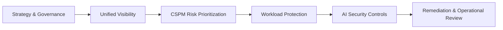

# CSES-01 — Cloud Security Envisioning & Strategy

[](https://skunkworks-academy.github.io/CSES-01/)
[](https://docusaurus.io/)
[](https://learn.microsoft.com/en-us/azure/defender-for-cloud/)
[](https://learn.microsoft.com/en-us/entra/)
[](https://learn.microsoft.com/en-us/collections/qrx3iqtkpwee6g?source=docs&sharingId=6319874F856A7FF8)

> **CSES-01** is a self-paced, GitHub-hosted courseware portal for the **Cloud Security Envisioning & Strategy** workshop. It converts a one-day instructor-led envisioning workshop into a structured digital learning experience with modules, labs, knowledge checks, and reusable instructor resources.

---

## Why Docusaurus?

This repo uses **Docusaurus** because it is well suited to Microsoft Learn-style courseware:

- Markdown and MDX authoring
- Sidebar navigation and document hierarchy
- Mermaid architecture diagrams
- Rich callout/admonition blocks
- GitHub Pages deployment
- Versionable courseware content
- Easy contribution workflow through GitHub pull requests

---

## Course focus

The course aligns to Microsoft cloud security strategy, governance, posture management, workload protection, AI security, and practical Defender for Cloud implementation.



---

## Repository structure

```text
CSES-01/
├── docs/
│   ├── index.mdx
│   ├── course-overview.mdx
│   ├── implementation-architecture.mdx
│   ├── modules/
│   ├── labs/
│   ├── assessments/
│   └── instructor/
├── src/
│   ├── components/
│   └── css/
├── static/
│   └── img/
├── .github/
│   └── workflows/deploy.yml
├── docusaurus.config.ts
├── sidebars.ts
└── package.json
```

---

## Quick start

```bash
gh repo clone skunkworks-academy/CSES-01
cd CSES-01

npm install
npm run start
```

Open the local development server:

```text
http://localhost:3000/CSES-01/
```

---

## Build and deploy

```bash
npm run build
npm run serve
```

Deployment is configured through GitHub Actions in:

```text
.github/workflows/deploy.yml
```

After the first successful deployment, enable GitHub Pages in the repository settings:

```text
Settings → Pages → Source → GitHub Actions
```

---

## Courseware backlog

| Item | Status | Owner |
|---|---:|---|
| Course overview | Started | Skunkworks Academy |
| One-day agenda | Started | Skunkworks Academy |
| Self-paced learning path | Started | Skunkworks Academy |
| Student lab guide | Drafted | Skunkworks Academy |
| Instructor prep guide | Drafted | Skunkworks Academy |
| Knowledge assessment | Drafted | Skunkworks Academy |
| GitHub Pages deployment | Configured | Skunkworks Academy |

---

## Source collection

Primary Microsoft Learn collection:

- [Cloud Security Envisioning & Strategy Workshop Syllabus — Microsoft Learn Collection](https://learn.microsoft.com/en-us/collections/qrx3iqtkpwee6g?source=docs&sharingId=6319874F856A7FF8)

Supporting topic areas:

- [Microsoft Defender for Cloud documentation](https://learn.microsoft.com/en-us/azure/defender-for-cloud/)
- [Microsoft Entra documentation](https://learn.microsoft.com/en-us/entra/)
- [Microsoft Sentinel documentation](https://learn.microsoft.com/en-us/azure/sentinel/)
- [Microsoft Purview documentation](https://learn.microsoft.com/en-us/purview/)
- [Microsoft Cloud Adoption Framework](https://learn.microsoft.com/en-us/azure/cloud-adoption-framework/)
- [Azure Well-Architected Framework](https://learn.microsoft.com/en-us/azure/well-architected/)

---

## License

Internal training content for Skunkworks Academy unless otherwise specified. Microsoft product names and links are used for training reference purposes.

