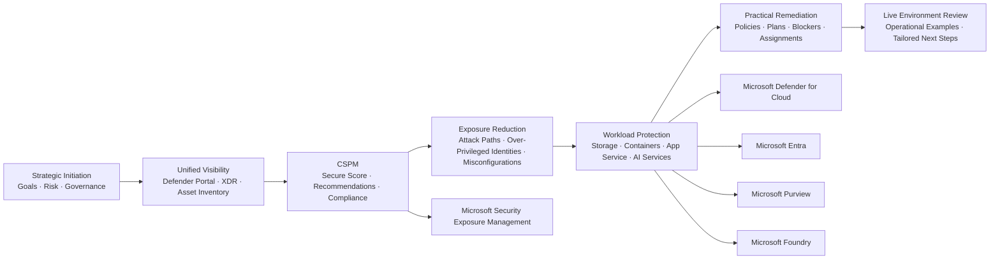
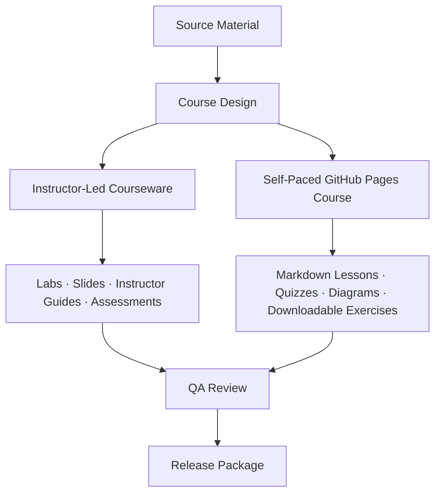

<div align="center">

# ☁️🔐 Cloud Security Envisioning & Strategy Workshop

### CESE323 ERC1.0 · Microsoft Defender for Cloud · Microsoft Entra · Microsoft Purview · Secure AI Workloads

<p>
  <a href="https://learn.microsoft.com/en-us/collections/qrx3iqtkpwee6g?source=docs&sharingId=6319874F856A7FF8">
    
  </a>
  <a href="https://learn.microsoft.com/en-us/azure/defender-for-cloud/">
    
  </a>
  <a href="https://learn.microsoft.com/en-us/training/courses/sc-5009">
    
  </a>
  <a href="#license">
    
  </a>
</p>

<p>
  
  
  
  
</p>

> A practical Microsoft cloud security workshop that moves learners from **strategy and governance** into **Microsoft Defender for Cloud configuration**, **Cloud Security Posture Management**, **workload protection**, **AI workload security**, and **live environment remediation**.

</div>

---

## 📌 Table of Contents

- [Course Snapshot](#-course-snapshot)
- [Workshop Purpose](#-workshop-purpose)
- [Learning Outcomes](#-learning-outcomes)
- [Delivery Formats](#-delivery-formats)
- [One-Day Instructor-Led Agenda](#-one-day-instructor-led-agenda)
- [Self-Paced Learning Path](#-self-paced-learning-path)
- [Microsoft Learn Alignment](#-microsoft-learn-alignment)
- [Architecture & Learning Flow](#-architecture--learning-flow)
- [Repository Structure](#-repository-structure)
- [Courseware Production Checklist](#-courseware-production-checklist)
- [Labs & Practical Scenarios](#-labs--practical-scenarios)
- [Assessment Strategy](#-assessment-strategy)
- [Facilitator Guidance](#-facilitator-guidance)
- [Learner Prerequisites](#-learner-prerequisites)
- [Quick Start](#-quick-start)
- [Contributing](#-contributing)
- [Source References](#-source-references)
- [License](#-license)

---

## 🧭 Course Snapshot

| Field | Details |
|---|---|
| **Course Code** | `CESE323 ERC1.0` |
| **Course Title** | Cloud Security Envisioning & Strategy Workshop |
| **Primary Stack** | Microsoft Defender for Cloud, Microsoft Defender XDR, Microsoft Entra, Microsoft Purview, Microsoft Foundry, Azure |
| **Delivery Model** | One-day instructor-led workshop + GitHub-hosted self-paced course |
| **Primary Audience** | Cloud security engineers, security architects, SecOps analysts, platform engineers, AI workload owners, IT decision makers |
| **Level** | Intermediate to Advanced, with optional SC-900 foundation bridge |
| **Core Outcome** | Convert cloud security strategy into actionable posture management, workload protection, identity hardening, and remediation activities |
| **Repository Purpose** | Host courseware, labs, slides, instructor guides, learner guides, assessments, and GitHub Pages self-paced content |

---

## 🎯 Workshop Purpose

This repository supports a one-day security envisioning workshop and an expandable self-paced learning experience focused on practical Microsoft cloud security implementation.

The course is designed to help teams:

- Align business security goals with measurable cloud security controls.
- Establish unified visibility across Microsoft security portals and cloud workloads.
- Reduce risk from misconfiguration, over-privileged identities, exposed attack paths, and weak workload protection.
- Harden critical workloads such as **AI services**, **containers**, **storage**, **App Service**, and data platforms.
- Move from conceptual strategy into hands-on configuration inside a controlled or customer-owned Azure environment.

---

## ✅ Learning Outcomes

By the end of the course, learners should be able to:

| Capability Area | Learner Can... |
|---|---|
| **Security Strategy** | Define cloud security goals, map risks to business priorities, and identify governance gaps. |
| **Cloud Posture Management** | Use Microsoft Defender for Cloud to review secure score, recommendations, regulatory compliance, asset inventory, and exposure paths. |
| **Threat Reduction** | Identify misconfigurations, over-privileged identities, high-risk resources, and attack paths. |
| **Workload Protection** | Select and configure appropriate Microsoft Defender workload protection plans. |
| **AI Security** | Understand AI workload risk, prompt injection exposure, data leakage risk, guardrails, and identity control requirements. |
| **Identity Security** | Apply Microsoft Entra concepts such as RBAC, managed identities, Conditional Access, workload identities, and identity governance. |
| **Operational Readiness** | Translate recommendations into remediation tasks, policy assignments, and operational runbooks. |
| **Live Review** | Evaluate a cloud environment and produce practical next-step recommendations. |

---

## 🧑‍🏫 Delivery Formats

| Format | Use Case | Recommended Duration | Output |
|---|---:|---:|---|
| **Instructor-Led Workshop** | Executive + technical cloud security envisioning | 1 day | Security strategy, posture review, prioritized remediation plan |
| **Self-Paced GitHub Course** | Learners complete modules asynchronously | 4–8 hours | Completion evidence, quizzes, lab notes, knowledge checks |
| **Blended Cohort** | Pre-work on GitHub, live lab day, post-work remediation | 1–2 weeks | Evidence-backed implementation plan |
| **Client Readiness Sprint** | Customer-specific Microsoft Defender for Cloud activation and review | 1–3 days | Defender readiness checklist, implementation blockers, remediation backlog |

---

## 🗓 One-Day Instructor-Led Agenda

> The original workshop syllabus compresses strategic security planning, Defender for Cloud posture work, workload protection selection, AI security, and live environment review into a single day. This agenda keeps that intent while making the timing practical for delivery.

| Timebox | Segment | Focus | Learner Output |
|---:|---|---|---|
| **90 min** | **Part 1 — Strategic Initiation & Governance** | Goals, priorities, risk vectors, Microsoft security stack overview, gap analysis | Draft security goals and priority risk list |
| **10 min** | Morning Break | Reset | — |
| **120 min** | **Part 2 — Configuration Control & Workload Protection** | Microsoft Defender portal, XDR view, CSPM, Security Exposure Management, workload protection options | Defender capability map and workload protection selection |
| **45 min** | Lunch Break | — | — |
| **75 min** | **Part 3 — Practical Implementation & Remediation** | Configure selected Defender components, AI-specific security, deployment blockers | Remediation checklist and policy assignment notes |
| **10 min** | Afternoon Break | Reset | — |
| **75 min** | **Part 4 — Hands-on Scenarios & Live Environment Review** | Incident-style scenarios, threat mapping, Defender for Cloud activation/review | Live environment observations and next-step recommendations |

### Workload Protection Selection

Select **two** workload protection modules for the live workshop, based on the customer environment:

| Option | Best For | Workshop Angle |
|---|---|---|
| **Defender for Storage** | Data layer protection, malware upload risk, suspicious access patterns | Secure storage accounts and data ingress points |
| **Defender for Containers** | AKS, Kubernetes workloads, container registries | Harden containerized workloads and cluster posture |
| **Defender for App Service** | Cloud-native apps and runtime services | Review app runtime exposure and platform security |
| **Defender for AI Services** | Azure AI Services, Microsoft Foundry, GenAI workloads | Monitor AI security posture, detect AI threats, reduce data leakage risk |

---

## 🧩 Self-Paced Learning Path

The self-paced version should run as a GitHub Pages course site backed by Markdown content, embedded diagrams, downloadable labs, and Microsoft Learn links.

### Recommended Route

| Phase | Module | Outcome |
|---:|---|---|
| **0** | Orientation & Environment Readiness | Learner understands repo structure, prerequisites, Azure access, and lab expectations. |
| **1** | Security, Compliance & Identity Foundation | Learner reviews shared responsibility, Zero Trust, defense in depth, encryption, GRC, and identity fundamentals. |
| **2** | Microsoft Entra for Cloud Security | Learner understands identity types, authentication, RBAC, Conditional Access, access reviews, PIM, and governance. |
| **3** | Microsoft Defender for Cloud Strategy | Learner maps Defender for Cloud to CSPM, CWPP, secure score, recommendations, asset inventory, and regulatory compliance. |
| **4** | Workload Protection Deep Dive | Learner evaluates Defender plans for servers, storage, SQL, open-source databases, Key Vault, Resource Manager, DNS, containers, and App Service. |
| **5** | AI Workload Security | Learner secures AI workloads using Defender for Cloud, Microsoft Foundry controls, guardrails, and Entra-based identity boundaries. |
| **6** | Live Review & Remediation | Learner completes a practical review, records evidence, and produces prioritized actions. |

---

## 🔗 Microsoft Learn Alignment

This course intentionally references Microsoft Learn resources rather than duplicating Microsoft content. Use the links below as the canonical study and reference sources.

| Course Area | Microsoft Learn Resource | Why It Matters |
|---|---|---|
| **Primary Collection** | [Cloud Security Envisioning & Strategy Workshop Collection](https://learn.microsoft.com/en-us/collections/qrx3iqtkpwee6g?source=docs&sharingId=6319874F856A7FF8) | Curated collection for this workshop. |
| **SCI Foundation** | [Course SC-900T00-A: Introduction to Microsoft Security, Compliance, and Identity](https://learn.microsoft.com/en-us/training/courses/sc-900t00) | Foundation bridge for learners new to Microsoft security concepts. |
| **Security Concepts** | [Introduction to security, compliance, and identity concepts](https://learn.microsoft.com/en-us/training/paths/describe-concepts-of-security-compliance-identity/) | Shared responsibility, Zero Trust, defense in depth, encryption, GRC. |
| **Microsoft Entra** | [Introduction to Microsoft Entra](https://learn.microsoft.com/en-us/training/paths/describe-capabilities-of-microsoft-identity-access/) | Identity, authentication, Conditional Access, RBAC, governance. |
| **Microsoft Security Solutions** | [Introduction to Microsoft security solutions](https://learn.microsoft.com/en-us/training/paths/describe-capabilities-of-microsoft-security-solutions/) | Defender XDR, Sentinel, Defender for Cloud, Security Copilot overview. |
| **Microsoft Purview** | [Introduction to Microsoft Purview and Microsoft privacy principles](https://learn.microsoft.com/en-us/training/paths/describe-capabilities-of-microsoft-compliance-solutions/) | Compliance, information protection, insider risk, audit, eDiscovery, governance. |
| **Defender for Cloud** | [Microsoft Defender for Cloud documentation](https://learn.microsoft.com/en-us/azure/defender-for-cloud/) | Product reference for posture management and workload protection. |
| **CSPM** | [Cloud Security Posture Management in Defender for Cloud](https://learn.microsoft.com/en-us/azure/defender-for-cloud/concept-cloud-security-posture-management) | Secure score, recommendations, compliance, risk prioritization. |
| **Workload Protections** | [Review workload protection](https://learn.microsoft.com/en-us/azure/defender-for-cloud/workload-protections-dashboard) | Defender workload protection dashboard and protected resource visibility. |
| **Workload Protection Module** | [Explain cloud workload protections in Microsoft Defender for Cloud](https://learn.microsoft.com/en-us/training/modules/understand-azure-defender-cloud-workload-protection/) | Workload protection concepts and service coverage. |
| **Secure AI** | [Course SC-5009-A: Secure AI solutions in the cloud using Microsoft Defender for Cloud and Microsoft Entra](https://learn.microsoft.com/en-us/training/courses/sc-5009) | AI workload security, Microsoft Foundry, Defender for Cloud, identity boundaries. |
| **SC-100 Architecture** | [Design solutions that align with security best practices and priorities](https://learn.microsoft.com/en-us/training/paths/sc-100-design-solutions-best-practices-priorities/) | Zero Trust, CAF, WAF, MCRA, MCSB, ransomware resilience, secure AI adoption. |

---

## 🏗 Architecture & Learning Flow



### Course Design Pattern



---

## 📁 Repository Structure

```text
.
├── README.md
├── CESE323ANN.txt
├── CESE323PKG.txt
├── course/
│   ├── overview.md
│   ├── agenda.md
│   ├── table-of-contents.md
│   ├── course-guide.md
│   └── feedback/
├── instructor/
│   ├── instructor-course-guide.md
│   ├── instructor-prep-guide.md
│   ├── instructor-agenda-changes.md
│   ├── instructor-errata.md
│   ├── instructor-lab-setup-guide.md
│   ├── instructor-lab-exercises-guide.md
│   └── instructor-lab-exercises-guide-with-hints.md
├── student/
│   ├── student-course-guide.md
│   ├── student-table-of-contents.md
│   ├── student-lab-exercises-guide.md
│   ├── student-lab-exercises-guide-with-hints.md
│   └── student-knowledge-assessment.md
├── labs/
│   ├── lab-00-environment-readiness/
│   ├── lab-01-defender-for-cloud-baseline/
│   ├── lab-02-cspm-secure-score-recommendations/
│   ├── lab-03-workload-protection-selection/
│   ├── lab-04-ai-workload-protection/
│   ├── lab-05-entra-identity-hardening/
│   └── lab-files/
├── slides/
│   ├── instructor-slide-show.pptx
│   └── exports/
├── site/
│   ├── index.html
│   ├── modules/
│   ├── assets/
│   └── styles/
├── assessments/
│   ├── quizzes/
│   ├── knowledge-checks/
│   ├── rubrics/
│   └── answer-keys/
├── docs/
│   ├── source-alignment.md
│   ├── references.md
│   └── qa-checklist.md
└── .github/
    └── workflows/
        └── pages.yml
```

---

## 🧾 Courseware Production Checklist

Use this checklist to track CESE323 ERC1.0 courseware build progress.

| Status | Asset | Owner | Notes |
|---|---|---|---|
| ⬜ | `CESE323ANN.txt` | Course owner | Announcement / course listing copy |
| ⬜ | `CESE323PKG.txt` | Course owner | Packaging metadata and release notes |
| ⬜ | Quick Course Overview with Full Table of Contents | Instructional designer | One-page overview + full TOC |
| ⬜ | Instructor Errata | QA lead | Known issues, delivery notes, corrections |
| ⬜ | Instructor Slide Show | Facilitator | Main ILT slide deck |
| ⬜ | Instructor Agenda Changes | Facilitator | One-day compression notes |
| ⬜ | Instructor Course Guide | Facilitator | Full delivery guide |
| ⬜ | Instructor Lab Exercises Guide with Hints | Lab author | Instructor-only support version |
| ⬜ | Instructor Lab Exercises Guide | Lab author | Standard instructor lab guide |
| ⬜ | Instructor Prep Guide | Facilitator | Setup, permissions, timing, demos |
| ⬜ | Instructor Lab Setup Guide | Lab author | Tenant/subscription setup |
| ⬜ | Lab Exercise Files | Lab author | Scripts, templates, screenshots, datasets |
| ⬜ | Student Lab Exercises Guide with Hints | Instructional designer | Optional guided learner copy |
| ⬜ | Student Lab Exercises Guide | Instructional designer | Main learner lab workbook |
| ⬜ | Student Course Guide | Instructional designer | Learner manual |
| ⬜ | Student Table of Contents | Instructional designer | Navigation and module map |
| ⬜ | Student Knowledge Assessment | Assessment author | Quiz + scenario questions |
| ⬜ | Course Feedback Forms | Course owner | Feedback, evaluation, improvement loop |

---

## 🧪 Labs & Practical Scenarios

| Lab | Scenario | Core Tooling | Evidence Required |
|---:|---|---|---|
| **Lab 00** | Environment readiness and access verification | Azure portal, Defender portal, Entra admin center | Screenshot of access, tenant/subscription details, role validation |
| **Lab 01** | Enable / review Microsoft Defender for Cloud baseline | Defender for Cloud | Secure score baseline, recommendations export |
| **Lab 02** | CSPM review and exposure prioritization | Defender CSPM, recommendations, compliance dashboard | Top 5 risks, impacted assets, priority remediation plan |
| **Lab 03** | Workload protection selection | Defender plans | Selected plan rationale and configuration screenshots |
| **Lab 04** | AI workload protection and guardrail review | Defender for Cloud, Microsoft Foundry, Microsoft Entra | AI risk controls, identity boundary notes, dashboard evidence |
| **Lab 05** | Identity hardening for cloud workloads | Microsoft Entra, RBAC, Conditional Access, managed identities | Over-privilege finding, recommended RBAC/CA changes |
| **Lab 06** | Live environment review and operational briefing | Defender portal, Azure portal, Microsoft Learn references | Final findings register and remediation backlog |

---

## 🧠 Assessment Strategy

Assessment should prove practical competence rather than passive reading completion.

| Assessment Type | Weight | Description |
|---|---:|---|
| Knowledge Checks | 20% | Short MCQs mapped to each module. |
| Lab Evidence | 35% | Screenshots, findings, configuration notes, and remediation observations. |
| Scenario Response | 25% | Learner explains what risk exists, why it matters, and how to remediate. |
| Final Operational Brief | 20% | Learner presents a prioritized Defender for Cloud improvement plan. |

### Suggested Competency Levels

| Level | Evidence |
|---|---|
| **Aware** | Can explain concepts and identify relevant Microsoft security services. |
| **Practitioner** | Can navigate portals, interpret recommendations, and complete guided remediation tasks. |
| **Operator** | Can prioritize findings, justify risk treatment, and create operational next steps. |
| **Architect** | Can align strategy, governance, workload protection, identity, compliance, and AI controls. |

---

## 🧑‍🏫 Facilitator Guidance

### Recommended Facilitation Pattern

1. **Start with business drivers**, not product menus.
2. **Map controls to risk**, not features to slides.
3. **Use the Defender portal early** to make posture visible.
4. **Limit live workload modules to two** in the one-day format.
5. **Use AI security as a high-impact scenario**, especially where Microsoft Foundry, Azure AI, or Copilot-style workloads are in scope.
6. **End with an operational backlog** that the customer can act on after the workshop.

### Instructor Notes

> [!TIP]
> Use the morning to establish strategic alignment and the afternoon to produce evidence, configuration observations, and remediation actions.

> [!IMPORTANT]
> For live customer environments, confirm authorization, RBAC permissions, subscription scope, and change-control boundaries before enabling or modifying Defender plans.

> [!WARNING]
> Do not perform destructive remediation during the workshop unless explicit approval and rollback steps are documented.

---

## 🧰 Learner Prerequisites

Recommended learner familiarity:

- Basic Azure subscription, resource group, networking, and identity concepts.
- Microsoft Entra ID basics, including users, groups, roles, authentication, and Conditional Access.
- Basic understanding of Microsoft Defender for Cloud and Microsoft Defender XDR.
- Familiarity with security concepts such as Zero Trust, shared responsibility, encryption, compliance, and risk management.
- For AI modules: basic understanding of Azure AI Services, Microsoft Foundry, model deployments, prompt flow, and data leakage risks.
- For hands-on labs: Reader, Security Reader, Contributor, Owner, or appropriately scoped lab roles depending on the task.

---

## 🚀 Quick Start

### 1. Clone the Repository

```bash
git clone https://github.com/<your-org>/<your-repo>.git
cd <your-repo>
```

### 2. Review the Course Overview

```bash
code README.md
code course/overview.md
code course/agenda.md
```

### 3. Build the GitHub Pages Version

Suggested static site options:

- Plain HTML + Markdown
- GitHub Pages with Jekyll
- MkDocs Material
- Docusaurus
- Next.js static export

Example MkDocs workflow:

```bash
pip install mkdocs-material
mkdocs serve
```

### 4. Prepare Lab Environment

```text
Required:
- Azure subscription
- Microsoft Defender for Cloud access
- Microsoft Entra access
- Defender portal access
- Optional Microsoft Foundry / Azure AI access
```

### 5. Publish

```bash
git add .
git commit -m "Initialize CESE323 cloud security courseware"
git push origin main
```

---

## 🧭 Suggested GitHub Pages Navigation

| Page | Purpose |
|---|---|
| `/` | Course landing page |
| `/overview/` | Course overview and learner outcomes |
| `/agenda/` | One-day ILT agenda |
| `/modules/` | Self-paced module index |
| `/labs/` | Lab exercise library |
| `/assessments/` | Knowledge checks and assessment guidance |
| `/instructor/` | Instructor-only guidance if access controlled |
| `/references/` | Microsoft Learn and documentation references |

---

## 🤝 Contributing

Contributions should improve clarity, technical accuracy, learner experience, or lab reliability.

### Contribution Guidelines

- Keep Microsoft Learn links canonical and current.
- Do not copy Microsoft Learn content directly; summarize and link instead.
- Use screenshots only when licensing and privacy rules allow it.
- Keep lab instructions reproducible and role-scoped.
- Add evidence requirements for each practical task.
- Validate all commands, portal paths, and screenshots before release.
- Record all changes in `docs/qa-checklist.md` or release notes.

### Pull Request Checklist

- [ ] Content aligns with the course objectives.
- [ ] Microsoft Learn references are linked and current.
- [ ] Lab instructions include prerequisites and expected outputs.
- [ ] Screenshots do not expose tenant secrets, IDs, or customer data.
- [ ] Assessment questions have answer keys and rationales.
- [ ] Markdown renders correctly in GitHub.
- [ ] Mermaid diagrams render correctly.
- [ ] Accessibility and readability have been reviewed.

---

## 📚 Source References

### Project Sources

- [Microsoft Learn Collection: Cloud Security Envisioning & Strategy Workshop](https://learn.microsoft.com/en-us/collections/qrx3iqtkpwee6g?source=docs&sharingId=6319874F856A7FF8)
- `Cloud Security Envisioning & Strategy Workshop Syllabus AZ.docx`
- Course source PDFs and Microsoft Learn captures stored in this repository’s source package.

### Microsoft Documentation & Training

- [Microsoft Defender for Cloud documentation](https://learn.microsoft.com/en-us/azure/defender-for-cloud/)
- [Cloud Security Posture Management in Microsoft Defender for Cloud](https://learn.microsoft.com/en-us/azure/defender-for-cloud/concept-cloud-security-posture-management)
- [Review workload protection in Microsoft Defender for Cloud](https://learn.microsoft.com/en-us/azure/defender-for-cloud/workload-protections-dashboard)
- [Secure score in Microsoft Defender for Cloud](https://learn.microsoft.com/en-us/azure/defender-for-cloud/secure-score-security-controls)
- [Course SC-900T00-A: Introduction to Microsoft Security, Compliance, and Identity](https://learn.microsoft.com/en-us/training/courses/sc-900t00)
- [Course SC-5009-A: Secure AI solutions in the cloud using Microsoft Defender for Cloud and Microsoft Entra](https://learn.microsoft.com/en-us/training/courses/sc-5009)
- [Design solutions that align with security best practices and priorities](https://learn.microsoft.com/en-us/training/paths/sc-100-design-solutions-best-practices-priorities/)
- [Secure AI in the Cloud Adoption Framework](https://learn.microsoft.com/en-us/azure/cloud-adoption-framework/ai/secure)

---

## 🛡 Security & Privacy Notes

- Do not commit real tenant IDs, subscription IDs, customer screenshots, secrets, keys, access tokens, or exported findings containing sensitive information.
- Use redacted screenshots for training assets.
- Store lab templates separately from real customer evidence.
- Use least privilege access for labs and demos.
- Validate AI workload examples for data leakage, prompt injection, unsafe outputs, and identity misconfiguration risks.

---

## 🧾 License

License to be confirmed by the course owner.

Recommended options:

| License | Suitable When |
|---|---|
| **Creative Commons BY-NC-SA** | Courseware may be shared and adapted non-commercially with attribution. |
| **Creative Commons BY-SA** | Open education sharing is allowed with attribution and share-alike requirements. |
| **MIT** | Code samples and lab scripts are intended for broad reuse. |
| **Private / Internal Use Only** | Client-specific workshop materials must not be redistributed. |

---

<div align="center">

**Built for practical cloud security enablement, secure AI adoption, and measurable Microsoft Defender for Cloud operational readiness.**

</div>
