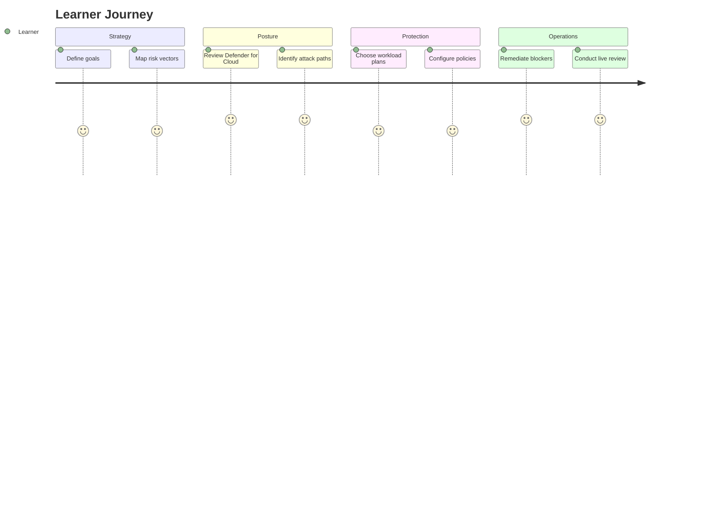

import AtAGlance from '@site/src/components/AtAGlance';

# Course Overview

**Cloud Security Envisioning & Strategy** is a Microsoft cloud security workshop that helps an organization define security priorities, understand current posture, reduce threat exposure, and move toward operational readiness with Microsoft Defender for Cloud and related Microsoft security services.

<AtAGlance
  items={[
    {label: 'Course code', value: 'CSES-01'},
    {label: 'Delivery mode', value: 'Self-paced + instructor-led adaptable'},
    {label: 'Primary platform', value: 'Microsoft Defender for Cloud'},
    {label: 'Companion services', value: 'Microsoft Entra, Sentinel, Purview'},
    {label: 'Level', value: 'Foundation to Intermediate'},
    {label: 'Output', value: 'Security strategy, posture actions, remediation plan'},
  ]}
/>

## Workshop objectives

| Objective | Outcome |
|---|---|
| Strategic alignment | Define security goals and prioritize risk mitigation based on business requirements. |
| Unified visibility | Build a single view of cloud security posture across Microsoft security services. |
| Threat reduction | Identify misconfigurations, over-privileged identities, attack paths, and exposure. |
| Workload hardening | Select workload protection for AI, containers, data, apps, and core cloud assets. |
| Operational readiness | Move from strategy to practical configuration, remediation, and review. |

## Target audience

- Security leaders and cloud decision makers
- Cloud security engineers
- Azure administrators
- Solution architects
- Managed security and MSP delivery teams
- Technical trainers building Microsoft security enablement

## Learning model

## Course modules

| Module | Focus | Practical output |
|---|---|---|
| 1 | Strategy, governance, risk framing | Security objectives and gap analysis |
| 2 | Defender for Cloud and CSPM | Posture visibility and prioritized recommendations |
| 3 | Workload protection | Defender plan selection matrix |
| 4 | AI security and identity | AI threat model and identity control plan |
| 5 | Remediation and operations | Remediation backlog and ownership model |
| 6 | Live review and capstone | Operational readiness summary |

## Completion criteria

A learner completes CSES-01 when they can:

- Explain where Microsoft Defender for Cloud fits in a cloud security architecture.
- Identify posture risks using CSPM concepts.
- Map selected risks to remediation actions.
- Recommend workload protection plans for priority assets.
- Explain AI-specific risks such as data leakage, prompt injection, unsafe model behavior, and over-privileged workload identities.
- Produce a concise operational readiness plan.

