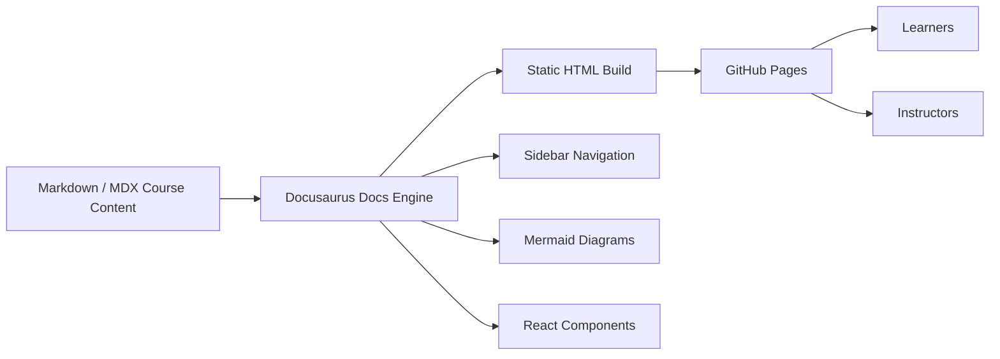
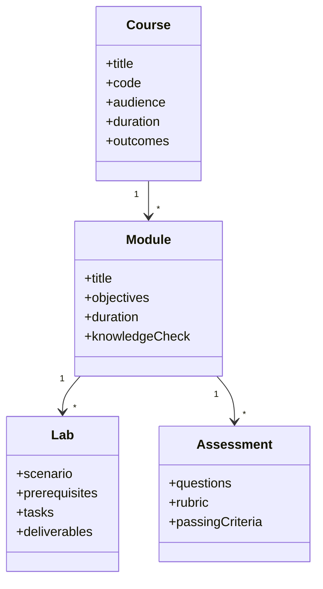

# Implementation Architecture

## Selected implementation layer

This repository uses **Docusaurus with TypeScript, MDX, Mermaid, and GitHub Pages**.

Docusaurus is the most suitable implementation layer for this project because it gives the course a Microsoft Learn-style authoring and navigation model without requiring a full LMS on day one.

## Architecture



## Why this stack

| Requirement | Docusaurus fit |
|---|---|
| GitHub-native courseware | Docs are plain Markdown/MDX files in the repo. |
| Microsoft Learn-style layout | Sidebar, cards, front matter, callouts, code blocks, and diagrams. |
| Rich technical documentation | Supports code, YAML, JSON, PowerShell, Bash, Mermaid, and MDX React components. |
| Low hosting cost | GitHub Pages handles public static hosting. |
| Contributor workflow | Git branches and pull requests support course review and QA. |
| Future LMS integration | Can later link to Moodle, SCORM packages, Microsoft Forms, GitHub Discussions, or Firebase progress tracking. |

## Content model



## Recommended development workflow

```bash
gh repo clone skunkworks-academy/CSES-01
cd CSES-01

npm install
npm run start
```

For new course content:

```bash
git checkout -b feature/module-02-cspm
# edit docs/modules/defender-cloud-posture.mdx
npm run build
git add .
git commit -m "Add CSPM module content"
git push -u origin feature/module-02-cspm
```

## Content standards

Every module should include:

- Title and description front matter
- Business context
- Learning objectives
- Conceptual explanation
- Architecture or process diagram
- Practical task
- Knowledge check
- References


