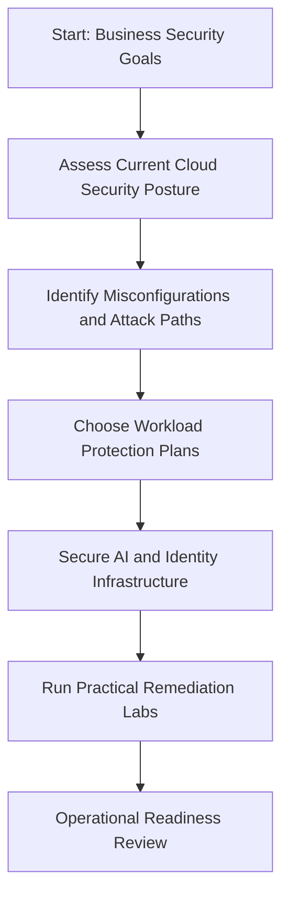

import CourseCard from '@site/src/components/CourseCard';
import AtAGlance from '@site/src/components/AtAGlance';

# CSES-01 — Cloud Security Envisioning & Strategy

  Microsoft Defender for Cloud
  CSPM
  Workload Protection
  Microsoft Entra
  AI Security
  Zero Trust

CSES-01 is a self-paced learning portal that helps security leaders, cloud engineers, and technical decision makers move from **cloud security strategy** to **practical Microsoft Defender for Cloud implementation**.

<AtAGlance
  items={[
    {label: 'Format', value: 'Self-paced course + labs'},
    {label: 'Audience', value: 'Security leaders, architects, engineers'},
    {label: 'Duration', value: 'One-day ILT converted to modular self-paced learning'},
    {label: 'Core stack', value: 'Defender for Cloud, Entra, Sentinel, Purview'},
  ]}
/>

:::tip Course goal
By the end of the course, learners should be able to evaluate a cloud security posture, identify attack paths and misconfigurations, choose workload protection plans, and plan operational remediation using Microsoft security services.
:::

## Learning path

  <CourseCard
    title="1. Strategic Initiation & Governance"
    level="Foundation"
    duration="45–60 min"
    description="Define security goals, risk priorities, stakeholder outcomes, and compliance alignment."
    to="/modules/01-strategic-initiation-governance"
  />
  <CourseCard
    title="2. Defender for Cloud & CSPM"
    level="Intermediate"
    duration="60–75 min"
    description="Use Microsoft Defender for Cloud to gain visibility, prioritize risk, and interpret recommendations."
    to="/modules/02-defender-cloud-posture"
  />
  <CourseCard
    title="3. Workload Protection"
    level="Intermediate"
    duration="60 min"
    description="Select and configure workload protection for servers, storage, containers, app services, databases, and AI."
    to="/modules/03-workload-protection"
  />
  <CourseCard
    title="4. AI Security & Identity"
    level="Intermediate"
    duration="60 min"
    description="Secure AI workloads using Defender for Cloud, Microsoft Entra, guardrails, identity boundaries, and monitoring."
    to="/modules/04-ai-security-identity"
  />

## Course flow

## Start here

1. Read the [course overview](./course-overview).
2. Review the [implementation architecture](./implementation-architecture).
3. Complete [Module 1](./modules/01-strategic-initiation-governance).
4. Work through the [Defender for Cloud onboarding lab](./labs/lab-01-defender-for-cloud-onboarding).
