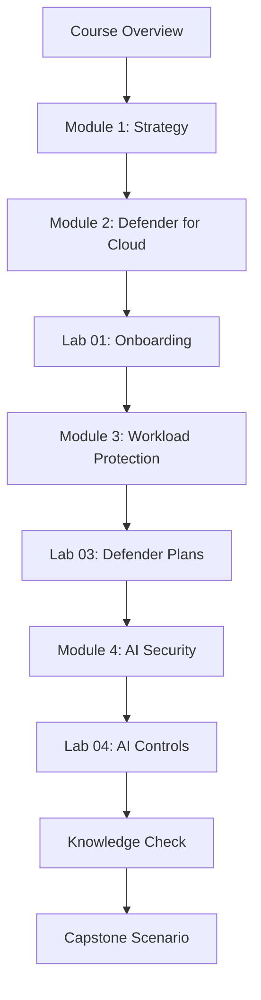

# Learner Path

## Recommended path

## Completion checklist

- [ ] Read the course overview.
- [ ] Complete Module 1.
- [ ] Complete Module 2.
- [ ] Complete Lab 01.
- [ ] Complete Module 3.
- [ ] Complete Lab 03.
- [ ] Complete Module 4.
- [ ] Complete Lab 04.
- [ ] Complete the knowledge check.
- [ ] Complete the capstone scenario.

