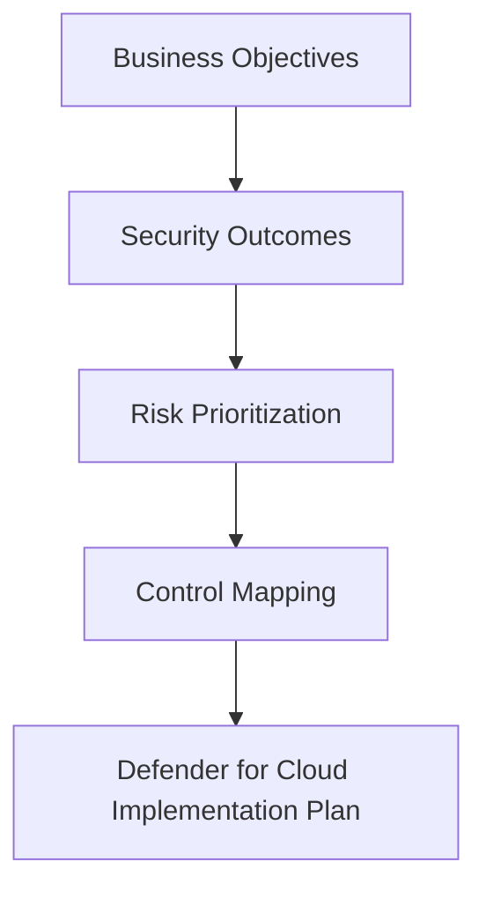

# Module 1: Strategic Initiation & Governance

## Purpose

This module frames the cloud security conversation before technical configuration begins. Learners define business-driven security goals, identify risk vectors, and align security decisions with governance, compliance, and operational priorities.

## Learning objectives

By the end of this module, learners can:

- Define core cloud security objectives for an organization.
- Identify high-value assets, business risk vectors, and likely attack paths.
- Explain how security goals influence Defender for Cloud configuration decisions.
- Build a simple gap analysis that connects business priorities to security controls.

## Strategic framing

## Key questions

| Area | Questions to answer |
|---|---|
| Business risk | What cloud assets are critical to revenue, operations, or customer trust? |
| Identity risk | Which privileged roles, service principals, managed identities, or guests could create high impact if compromised? |
| Data risk | Where is sensitive, regulated, or high-value data stored? |
| Compliance | Which standards, customer requirements, or internal policies must be demonstrated? |
| Operations | Who owns triage, remediation, monitoring, and reporting? |

:::info Instructor note
This section is ideal for an opening whiteboard exercise. Ask learners to map three critical assets, three identity risks, and three high-impact misconfiguration scenarios.
:::

## Practical activity

Create a one-page **Security Outcomes Canvas**.

| Field | Example |
|---|---|
| Primary business outcome | Reduce cloud breach risk across Azure workloads |
| Priority workloads | Identity, storage, containers, AI services |
| Primary risks | Over-privileged identities, exposed storage, weak network boundaries |
| Success measure | Defender for Cloud recommendations reduced and prioritized |
| Owner | Cloud security lead / platform engineering |

## Knowledge check

1. Why should security goals be defined before enabling workload protection plans?
2. What is the difference between a technical misconfiguration and a business risk?
3. Why are identities often treated as a primary security perimeter?
4. How does governance influence remediation prioritization?

