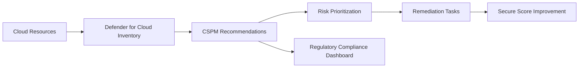

---
title: "Module 2: Defender for Cloud & CSPM"
description: Use Microsoft Defender for Cloud and Cloud Security Posture Management to identify risk, recommendations, attack paths, and compliance gaps.
---

# Module 2: Defender for Cloud & CSPM

## Purpose

This module introduces Microsoft Defender for Cloud as the primary platform for visibility, posture management, workload protection, and security recommendations across Azure, hybrid, and multicloud environments.

## Learning objectives

By the end of this module, learners can:

- Explain the role of Microsoft Defender for Cloud.
- Describe Cloud Security Posture Management.
- Interpret Secure Score, recommendations, and regulatory compliance views.
- Identify misconfigurations, attack paths, and over-privileged identities.
- Prioritize remediation using risk context.

## CSPM operating model

## Core concepts

| Concept | Meaning |
|---|---|
| Secure Score | A posture measurement that helps teams track improvement over time. |
| Recommendations | Hardening guidance based on discovered resource configuration and security baselines. |
| Attack paths | Chained risks that show how an attacker might move through resources. |
| Regulatory compliance | A mapped view of posture against standards and controls. |
| Security Explorer | Graph-style investigation of resources, attack paths, and cloud risks. |

:::warning
Do not treat Secure Score as the only KPI. Use it together with business criticality, exploitability, blast radius, identity privilege, and compliance impact.
:::

## Practical activity

Build a **Posture Review Register**.

| Finding | Risk | Priority | Owner | Remediation |
|---|---|---:|---|---|
| Publicly exposed storage account | Data leakage | High | Cloud platform team | Disable public access and apply private endpoint |
| Excessive contributor assignments | Privilege escalation | High | Identity team | Replace broad role with scoped RBAC |
| Missing vulnerability assessment | Unknown exposure | Medium | Security operations | Enable assessment and assign remediation SLA |

## Knowledge check

1. What problem does CSPM solve?
2. Why are attack paths more actionable than isolated recommendations?
3. How should teams prioritize recommendations when there are hundreds of findings?
4. Which stakeholders should receive compliance posture reports?

