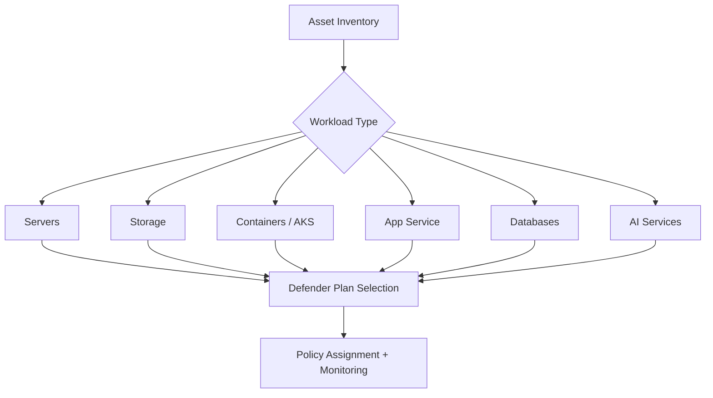

---
title: "Module 3: Workload Protection"
description: Select Defender for Cloud workload protection plans for servers, containers, app services, storage, databases, APIs, and AI workloads.
---

# Module 3: Workload Protection

## Purpose

This module helps learners select the correct Cloud Workload Protection Platform plans in Microsoft Defender for Cloud based on asset type, risk, and business criticality.

## Learning objectives

By the end of this module, learners can:

- Explain how Defender for Cloud workload protection plans function.
- Select protection plans for different workload types.
- Identify which plans are appropriate for data, container, application, and AI workloads.
- Build a workload protection selection matrix.

## Workload protection selection

## Selection matrix

| Workload | Example risks | Defender focus |
|---|---|---|
| Storage | Malware upload, suspicious access, public exposure | Defender for Storage |
| Containers / AKS | Image vulnerabilities, runtime threats, misconfigured clusters | Defender for Containers |
| App Service | Runtime threats, weak app configuration, exposed app surface | Defender for App Service |
| Databases | Vulnerability exposure, suspicious access, weak configuration | Defender for SQL / databases |
| AI services | Data leakage, prompt injection indicators, AI workload exposure | Defender for AI Services |
| Servers | Endpoint exposure, vulnerabilities, missing agents, malware | Defender for Servers |

:::tip
For a one-day workshop, select two workload protection deep dives based on the customer’s live environment and priority assets.
:::

## Practical activity

Create a **Defender Plan Recommendation Table**.

| Asset group | Criticality | Current protection | Recommended plan | Justification |
|---|---:|---|---|---|
| Production AKS | High | Partial | Defender for Containers | Runtime and cluster hardening |
| Azure Storage data lake | High | None | Defender for Storage | Malware and suspicious access monitoring |
| AI Foundry project | High | None | Defender for AI Services | AI posture and threat monitoring |

## Knowledge check

1. Why should workload protection be selected based on business criticality?
2. What are the primary risks for containerized workloads?
3. Why does storage protection matter in AI and data workflows?
4. What is the difference between CSPM guidance and workload threat detection?

