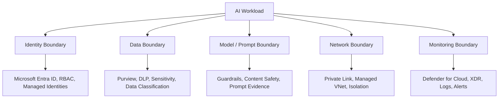

# Module 4: AI Security & Identity

## Purpose

This module focuses on AI-specific security concerns such as prompt injection, data leakage, unsafe model behavior, identity scope, and workload authorization. It connects Microsoft Defender for Cloud, Microsoft Entra, and Microsoft Foundry security controls.

## Learning objectives

By the end of this module, learners can:

- Explain the shared responsibility model for AI workloads.
- Identify AI workload risks and control points.
- Explain why identity is a control layer for AI solutions.
- Apply Conditional Access, RBAC, managed identity, Key Vault, logging, and network isolation considerations.
- Describe guardrails and monitoring patterns for Microsoft Foundry solutions.

## AI security control model

## AI threat examples

| Threat | Security concern | Control direction |
|---|---|---|
| Prompt injection | Malicious instructions influence model output or data access | Guardrails, app-layer validation, prompt monitoring |
| Data leakage | Sensitive context or files exposed through prompts/responses | Purview, DLP, access controls, output review |
| Over-privileged workload identity | AI app or agent accesses more than required | Least privilege RBAC and managed identity scoping |
| Unsafe model behavior | Policy-violating outputs or risky actions | Microsoft Foundry guardrails and safety filters |
| Unmonitored AI endpoint | No visibility into usage, abuse, or anomalous access | Diagnostic logging and Defender alerts |

:::warning
AI security must be designed before deployment. Retrofitting identity, logging, data boundaries, and guardrails after release usually creates operational friction and blind spots.
:::

## Practical activity

Build an **AI Security Design Checklist**.

- [ ] Identify AI service/resource owner.
- [ ] Identify data sources and sensitivity labels.
- [ ] Confirm managed identity or service principal scope.
- [ ] Review RBAC assignments.
- [ ] Confirm Key Vault or secret storage pattern.
- [ ] Confirm private networking requirements.
- [ ] Enable diagnostic logging.
- [ ] Review Defender for Cloud AI workload recommendations.
- [ ] Define response process for AI security alerts.

## Knowledge check

1. Why is identity a control layer for AI solutions?
2. What is the security risk of over-scoped managed identities?
3. How do guardrails differ from monitoring?
4. Why should AI workloads be included in posture management?

