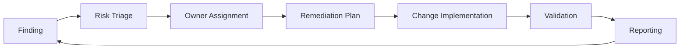

# Module 5: Remediation & Operations

## Purpose

This module converts strategy and posture findings into executable remediation work. Learners define owners, SLAs, prioritization rules, reporting formats, and governance loops.

## Learning objectives

By the end of this module, learners can:

- Convert Defender for Cloud findings into prioritized remediation tasks.
- Define ownership across security, identity, platform, and application teams.
- Create a remediation backlog.
- Explain how security operations, DevSecOps, and governance teams coordinate.

## Remediation workflow

## Remediation backlog template

| Priority | Finding | Impact | Owner | Target date | Validation |
|---:|---|---|---|---|---|
| P1 | Public access on sensitive storage | Data exposure | Platform team | 7 days | Public access disabled |
| P1 | Excessive privileged roles | Privilege escalation | Identity team | 14 days | RBAC reviewed and scoped |
| P2 | Missing Defender plan | Reduced threat visibility | Security team | 21 days | Plan enabled and alerts monitored |
| P3 | Missing tagging | Weak ownership visibility | Cloud governance | 30 days | Tags applied and policy created |

:::tip
A useful remediation plan should be small enough to execute and specific enough to verify.
:::

## Knowledge check

1. What makes a remediation action measurable?
2. Why should risk owners be assigned before technical implementation?
3. How should teams handle findings that require application downtime?
4. Why is validation separate from implementation?
