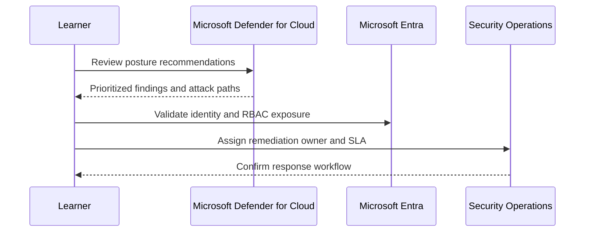

# Module 6: Hands-on Scenarios & Live Environment Review

## Purpose

This module brings the workshop together through real-world scenarios, operational review, and environment-specific recommendations. It is the bridge between training and customer implementation.

## Learning objectives

By the end of this module, learners can:

- Demonstrate product capabilities through realistic security scenarios.
- Map discovered vulnerabilities to Microsoft-recommended mitigations.
- Walk through Defender for Cloud settings in a live or demo environment.
- Produce tailored operational examples and next-step actions.

## Scenario model

## Capstone scenario

A customer has recently deployed cloud-hosted applications, storage accounts, container workloads, and a new AI workload. The environment has inconsistent security configuration, uncertain ownership, and limited operational reporting.

Learners must produce:

- Top five risks.
- Recommended Defender for Cloud plan selections.
- Identity and RBAC concerns.
- AI workload security concerns.
- Remediation backlog.
- 30-day operational action plan.

## Output: Operational readiness summary

| Section | Required content |
|---|---|
| Current posture | Key issues, risk themes, visibility gaps |
| Recommended actions | Prioritized fixes with owners |
| Workload protection | Selected plans and rationale |
| AI security | Identity, data, guardrail, monitoring controls |
| Reporting | Executive and technical reporting cadence |
| Next steps | 30-day implementation plan |

